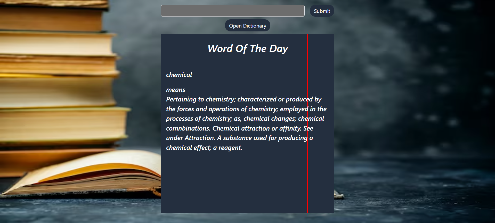
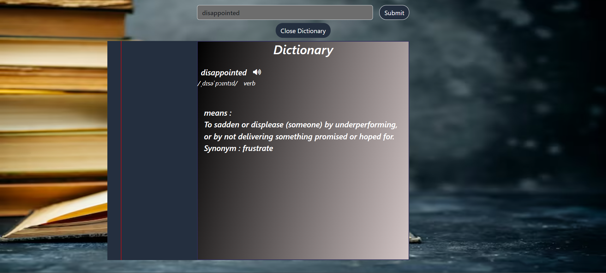

# WordWonders 📖

Welcome to WordWonders, where every word is a treasure waiting to be discovered! Dive into the world of words with our daily "Word of the Day" and explore the depths of language through our intuitive search functionality.

Check out the live website: [WordWonders](https://aakashgaur03.github.io/WordWonders/)

# Images

## Features 🌟

Word of the Day: Uncover a new word's meaning every day.
Search Functionality: Look up specific words and unlock their definitions.
How to Use 🧐
Word of the Day: Visit the homepage to be enchanted by the Word of the Day.
Search: Use the search bar to embark on a journey through the pages of our dictionary.
Technologies Used 💻
Frontend: HTML, CSS, Bootstrap
API Integration: Fetch API, jQuery
Responsiveness: Optimized for all devices
